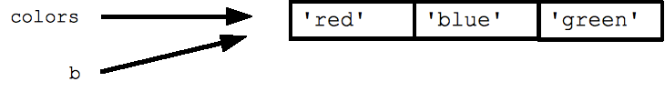
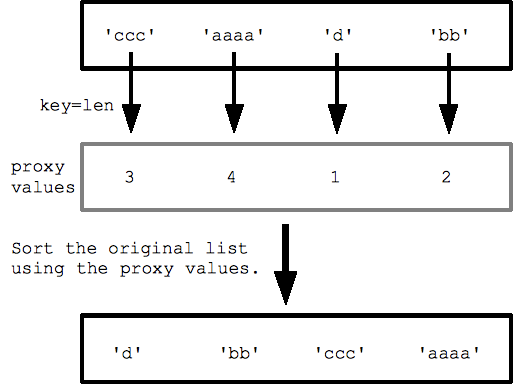

// tag::javascript[]
ifdef::javascript,showall[]

TBD

endif::[]
// end::javascript[]

// tag::csharp[]
ifdef::csharp,showall[]

TBD

endif::[]
// end::csharp[]


// tag::python[]
ifdef::python,showall[]

=== Lists

Arrays in Python are called "Lists".
Assignment with '=' on lists does not make a copy, just points to same memory location
```
colors = ['red', 'blue', 'green']
b = colors
```


To make a copy of a list
b = color[:] # the pythonic way

"for var in list" # do not modify the list while iterating over it
"if var in list"

Strings can be considered a list of chars

  ## print the numbers from 0 through 99
  for i in range(100):
    print i

Common pattern way to start building lists
  list = []          ## Start as the empty list
  list.append('a')   ## Use append() to add elements
  list.append('b')

// List Methods
List.append(elem)
List.sort() # see sorted() as preferred function to sort
List.index(elem)
List.pop(index)
List.extend
…

del colors[1] # works similar to list.pop(index)
del colors # removes the definition of the variable from memory like it was never declared

List to String, String to List
b = ':'.join(colors) # returns red:blue:green
b.split(':') # returns ['red', 'blue', 'green']

Slicing
  list = ['a', 'b', 'c', 'd']
  print list[1:-1]   ## ['b', 'c']
  list[0:2] = 'z'    ## replace ['a', 'b'] with ['z']
  print list         ## ['z', 'c', 'd']

==== Sorting

sorted(list, [reverse=False], [key=None], [cmp=None]) function, takes a list a returns a new list in sorted order (original is not changed) (recommended)

strs = ['ccc', 'aaaa', 'd', 'bb']
print sorted(strs, key=len)  ## ['d', 'bb', 'ccc', 'aaaa']



Tuples - A tuple is a fixed size grouping of elements, such as an (x, y) co-ordinate. Tuples are like lists, except they are immutable and do not change size (tuples are not strictly immutable since one of the contained elements could be mutable).

  tuple = (1, 2, 'hi')
  print len(tuple)  ## 3
  print tuple[2]    ## hi
  tuple[2] = 'bye'  ## NO, tuples cannot be changed
  tuple = (1, 2, 'bye')  ## this works
  tuple = ('hi',)   ## size-1 tuple

Assigning tuple of variable names
  (x, y, z) = (42, 13, "hike")
  print z  ## hike
  (err_string, err_code) = Foo()  ## Foo() returns a length-2 tuple

Example (tuples + sorted):
Given list of tuples, sort each tuple by the last element in the tuple
# e.g. [(1, 7), (1, 3), (3, 4, 5), (2, 2)] yields
# [(2, 2), (1, 3), (3, 4, 5), (1, 7)]

# Extract the last element from a tuple -- used for custom sorting below.
def last(a):
  return a[-1]

def sort_last(tuples):
  return sorted(tuples, key=last)

Example:
a = [ (1, 'b'), (2, 'a'), (1, 'a')]
sorted(a) # returns [ (1, 'a'), (1, 'b'), (2, 'b')] #sorts by the first value in the tuple, then the second value

List Comprehensions
The syntax is [ expr for var in list ] -- the for var in list
  nums = [1, 2, 3, 4]
  squares = [ n * n for n in nums ]   ## [1, 4, 9, 16]

Can add an if test to the right of the for-loop to narrow the result list
  ## Select values <= 2
  nums = [2, 8, 1, 6]
  small = [ n for n in nums if n <= 2 ]  ## [2, 1]

  ## Select fruits containing 'a', change to upper case
  fruits = ['apple', 'cherry', 'banana', 'lemon']
  afruits = [ s.upper() for s in fruits if 'a' in s ]
  ## ['APPLE', 'BANANA']

What's supposed to happen here?
>>> b = [ 'dd', 'd', 'ddd']
>>> def Last(b): return b[-1]
Expected: [ 'd', 'dd', 'ddd']
Actual: [ 'dd', 'd', 'ddd']

==== List Comprehensions

```
a = [ 'aaaa', 'bb', 'cccc']
[ len(s) for s in a ] # returns [ 4, 2, 4]
[ len(s)    for s in a   if len(s)>2 ] # returns [ 4, 4]
```
***Beware of code complexity with using to many nested list comprehensions***

=== Dict

Dict = Key/Value hash table structure

dict = {} # empty dict
dict = {'a': 'alpha', 'b': 'beta'} # declare in series
dict['a'] = 'alpha' # built up using [ ]

  print dict['a']     ## Simple lookup, returns 'alpha'
  dict['a'] = 6       ## Put new key/value into dict
  'a' in dict         ## True
  ## print dict['z']                  ## Throws KeyError
  if 'z' in dict: print dict['z']     ## Avoid KeyError
  print dict.get('z')  ## None (instead of KeyError)
  print dict.get('z', 'nada') ## returns a default value 'Nada' if key not-found

Dict.keys()
Dict.values()
Dict.items() # tuple list of [ (k, v), …]

Dict Formatting
  hash = {}
  hash['word'] = 'garfield'
  hash['count'] = 42
  s = 'I want %(count)d copies of %(word)s' % hash  # %d for int, %s for string
  # 'I want 42 copies of garfield'

For Dict, retrieval by a "key" happens in constant time (very fast)
Splitting by whitespace "aaa bbb ccc".split()

endif::[]
// end::python[]