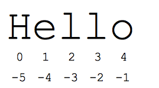

// tag::javascript[]
ifdef::javascript,showall[]

TBD

endif::[]
// end::javascript[]

// tag::python[]
ifdef::python,showall[]

```
//multi-line text
"""This is multilne
example of text"""

"This is another type \
of mulitline text"

//basic
  s = 'hi'
  print s[1]          ## i
  print len(s)        ## 2
  print s + ' there'  ## hi there

raw = r'this\t\n and that'
  # this\t\n and that
  print raw

//string methods
s.lower()
S.string()
S.startswith
S.find()
S.replace('old', 'new')
S.split('delim')
S.join(list)
s[start:end] //slicing
```


```
//Printf-type format string, spanned across multiple lines
  # Split the line into chunks, which are concatenated automatically by Python
  text = (
    "%d little pigs come out, "
    "or I'll %s, and I'll %s, "
    "and I'll blow your %s down."
    % (3, 'huff', 'puff', 'house'))

# remember if only formatting one variable to specify a trailing comma i.e.
"… % (3,)"
```


endif::[]
// end::python[]